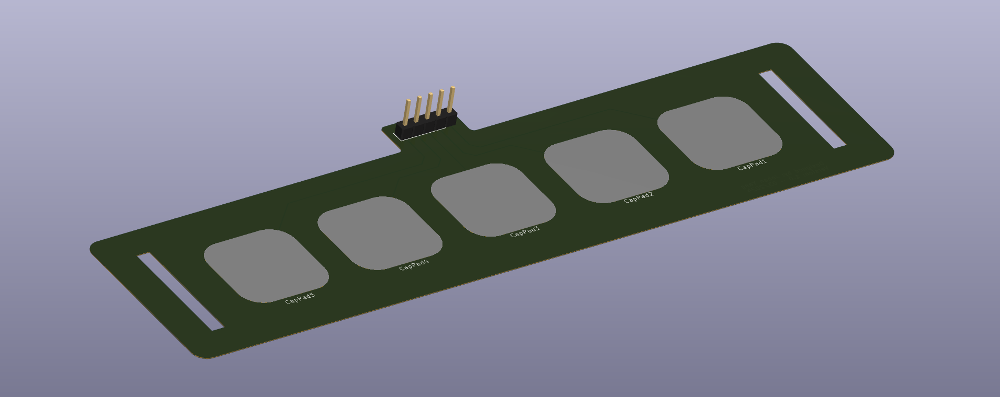

# :arrow_heading_up: Capacitive Pads Sensor
Kicad files to make a custom capacitive pads sensor. Uses standard male header pins with 0.1 inch pitch, so can be directly inserted into many capacitive breakout boards. 

